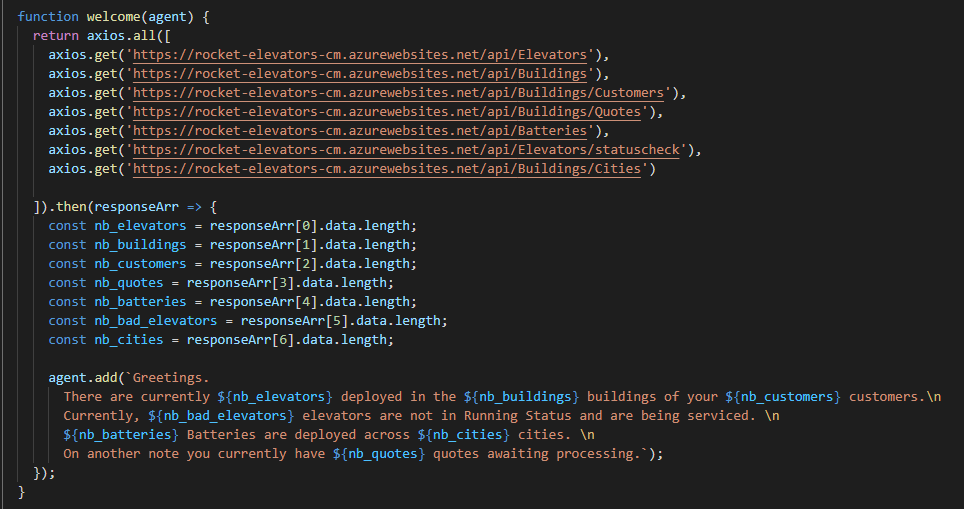
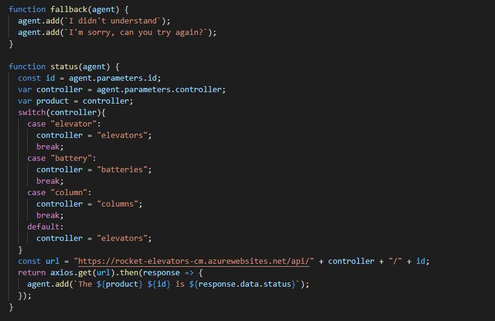
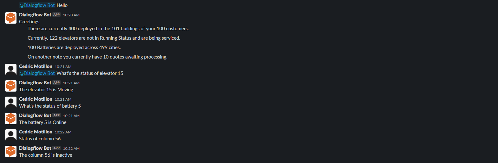

# RocketElevators-AI-Chatbot

<h3>This week we had to work on Artificial Intelligence as a Service.</h4>

<b>Documentation followed:</b>  
<ul>
    <li><a href="https://cobusgreyling.medium.com/how-to-create-a-chatbot-with-google-dialogflow-60616c2b802f"> How To Create A Chatbot With Google Dialogflow </a></li>
    <li><a href="https://cloud.google.com/architecture/building-and-deploying-chatbot-dialogflow"> Building and deploying a chatbot by using Dialogflow (overview) </a></li>
</ul>

<b>Creating intent</b>  
Creating an intent was pretty simple. The only important part was to make sure you enable the webhook call for your intent. That way you can customize your response in the fullfilment tab.

<b>Fullfilment</b>  
For the fullfilment, you have to make an API call to retrieve info of the product you desire. For that, I used axios which let me do multiple calls.

<b>Chatbot in Slack</b>
You then had to add the chatbot in slack. You can do that by going in the Integrations tab and go down to the Text Based section. I decided to just use the test option since we're in development. You can then @ the chatbot and then ask your question and it will answer.

