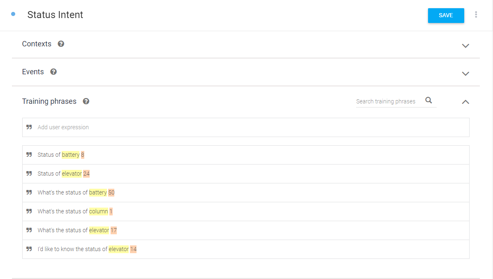
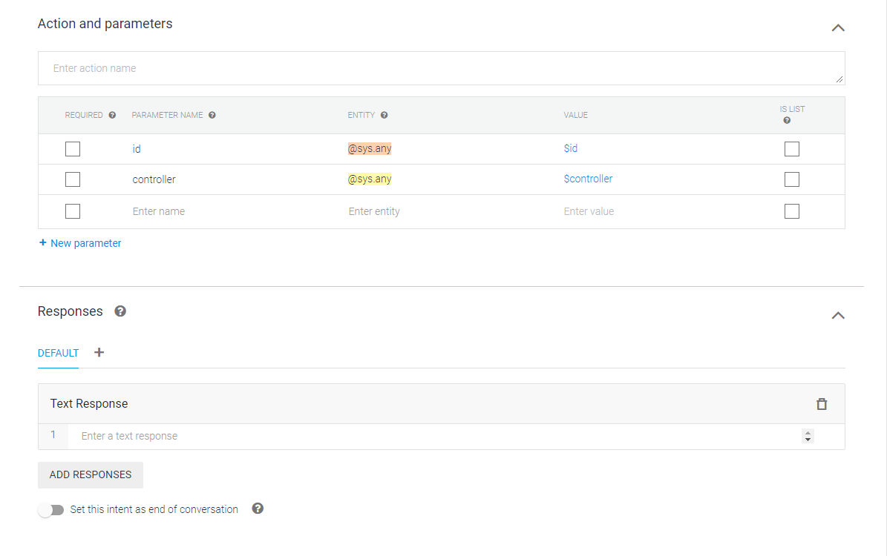
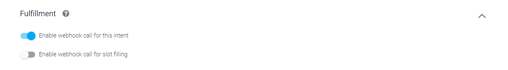

# RocketElevators-AI-Chatbot

<h3>This week we had to work on Artificial Intelligence as a Service.</h4>

<b>Documentation followed:</b>  
<ul>
    <li><a href="https://cobusgreyling.medium.com/how-to-create-a-chatbot-with-google-dialogflow-60616c2b802f"> How To Create A Chatbot With Google Dialogflow </a></li>
    <li><a href="https://cloud.google.com/architecture/building-and-deploying-chatbot-dialogflow"> Building and deploying a chatbot by using Dialogflow (overview) </a></li>
</ul>

For the controller status intent:

